# E-commerce project

  
  
  
  
  
  
  

An E-commerce project with completely different user-expirience for sellers & buyers. A ***role*** (seller/buyer) is being allocated to user upon signing up on the platform.
Sellers can upload their products and keep track of their stocks, while the buyers can buy from a wide-variety of fashion-realted products.  
This repository has **2 Branches**:

* **master** : This branch contains the code with the proper implementation of ***redis-caching***. Hence before running the code in this branch you should install and run redis-server on your device. 
* **without_redis** : The code in this branch does not implement caching and hence can be directly cloned and run without the need to setup redis.

## Screens for Buyer-role

* ### Categorized Products ### 

  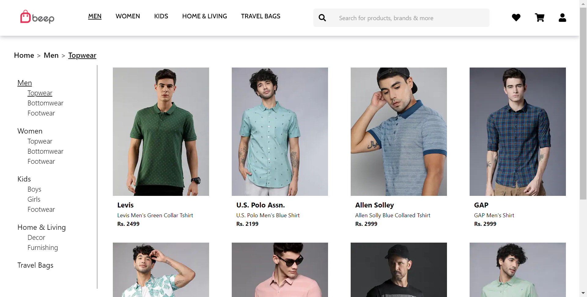

* ### Product detail page ###

  

* ### Wishlist ###

  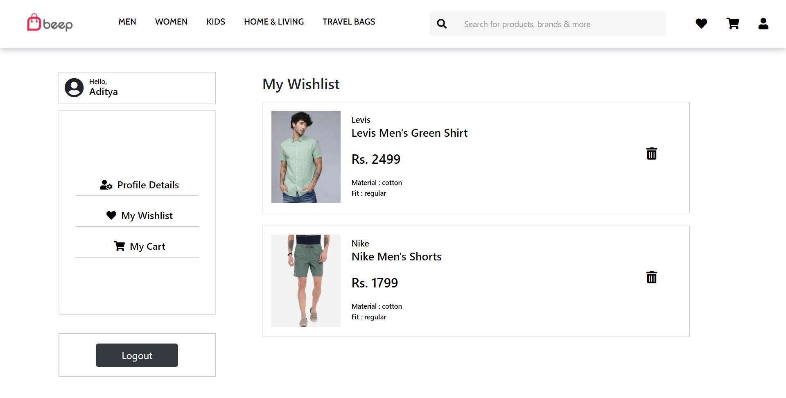

* ### Cart ###

  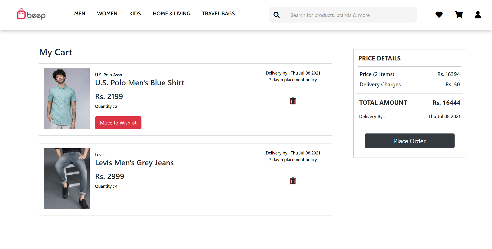

* ### Profile Details ###

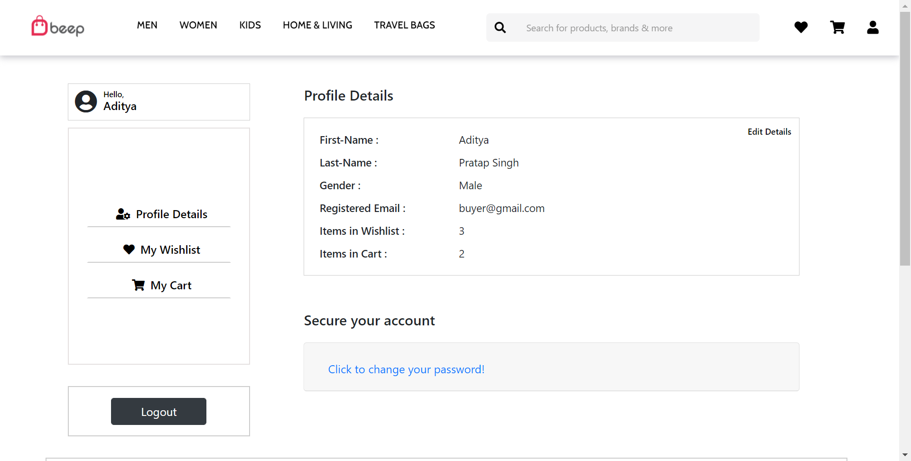

* ### Past Orders ###

  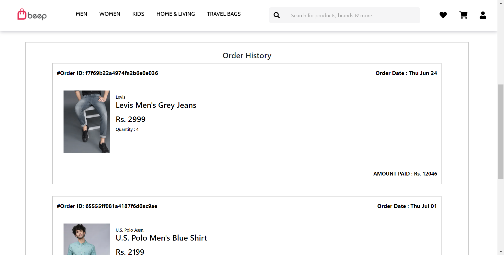

* ### Featured Products

  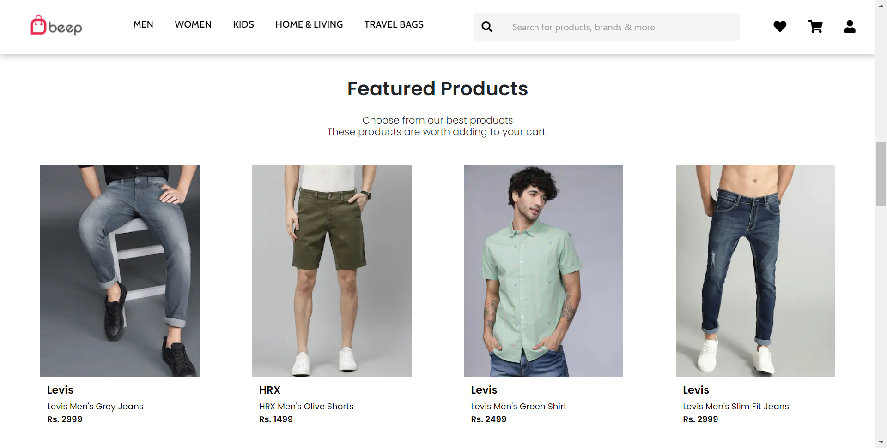

* ### Personalized Products

  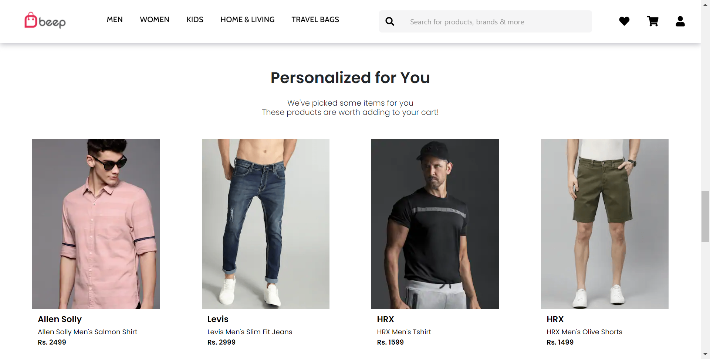

* ### Landing Page ###

  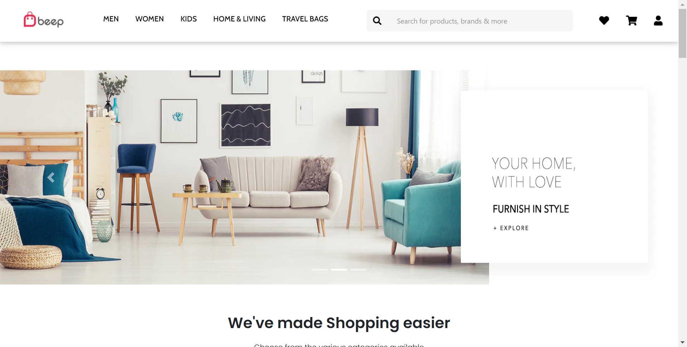

## Screens for Seller-role

* ### Landing Page ### 

  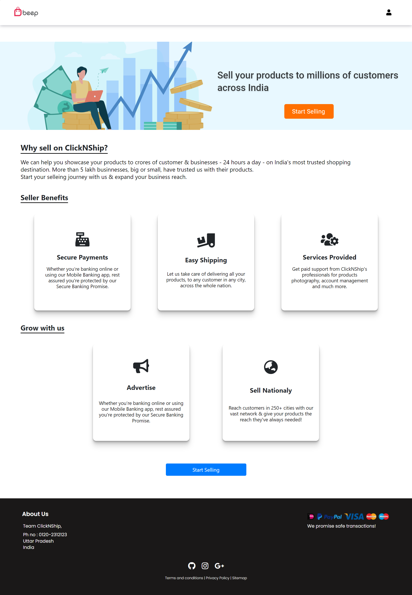

* ### Upload Product ### 

  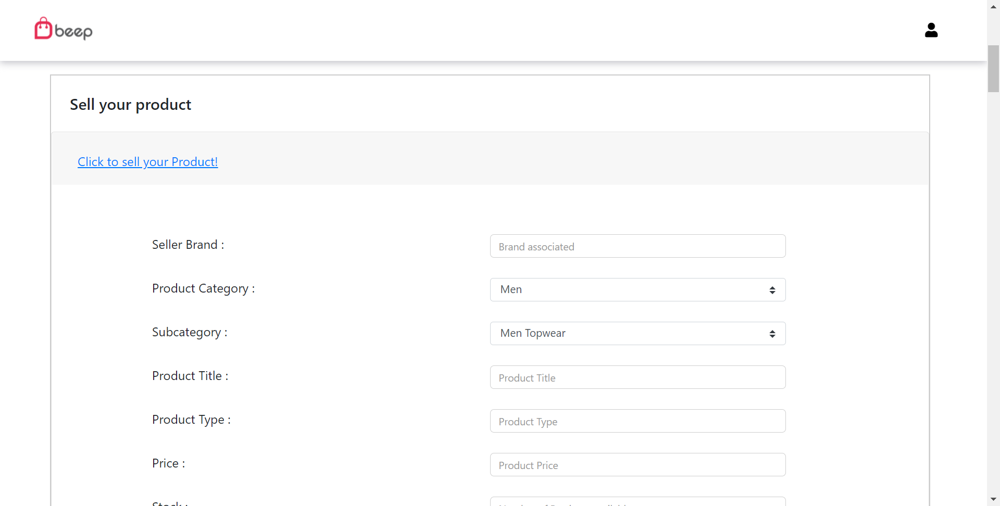

* ### View Products' stocks ### 

  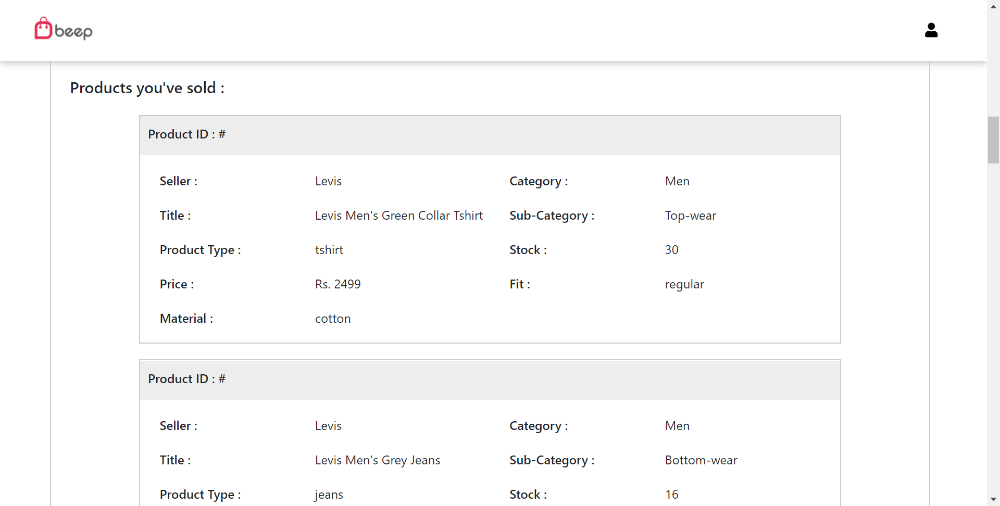

